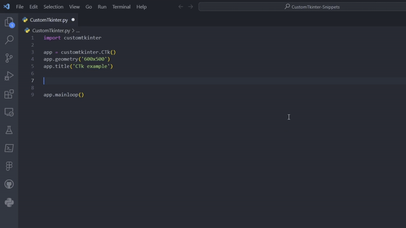

# CustomTkinter Snippets

CustomTkinter Snippets is a Visual Studio Code extension that provides a comprehensive set of snippets for efficiently working with CustomTkinter, a custom toolkit for Python GUI development. This extension enhances your development workflow by offering quick access to commonly used CustomTkinter components and features directly within the VS Code editor.

## Features

- **Efficient Workflow**: Speed up your development process with easy-to-use snippets for creating CustomTkinter widgets and implementing various functionalities.

- **Comprehensive Coverage**: Access snippets for a wide range of CustomTkinter components, including buttons, checkboxes, combo boxes, entry fields, frames, labels, option menus, progress bars, radio buttons, scrollable frames, segmented buttons, sliders, switches, tab views, textboxes, scrollbars, windows, images, fonts, top-level windows, input dialogs, and more.

- **Customization Options**: Utilize snippets to set appearance modes, themes, widget scaling, window scaling, and automatic DPI awareness according to your application requirements.

## Installation

1. Open Visual Studio Code.
2. Go to the Extensions view by clicking on the square icon in the Sidebar or pressing `Ctrl+Shift+X`.
3. Search for "CustomTkinter Snippets".
4. Click on the Install button.

## Usage

1. Open a Python file in Visual Studio Code.
2. Type the snippet prefix (e.g., `ctkbutton` for a button widget) and press `Tab` to insert the snippet code.
3. Customize the snippet code as needed for your application.

## Example

## Snippets

### Widgets

| Prefix               | Snippet Description                                                              |
| -------------------- | -------------------------------------------------------------------------------- |
| `ctkbutton`          | Inserts a snippet for button widget                                              |
| `ctkbutton.grid`     | Inserts a snippet for placing a button widget using grid layout                  |
| `ctkbutton.pack`     | Inserts a snippet for placing a button widget using pack layout                  |
| `ctkcheckbox`        | Inserts a snippet for checkbox widget                                            |
| `ctkcheckbox.grid`   | Inserts a snippet for placing a checkbox widget using grid layout                |
| `ctkcheckbox.pack`   | Inserts a snippet for placing a checkbox widget using pack layout                |
| `ctkcombobox`        | Inserts a snippet for combo box widget                                           |
| `ctkcombobox.grid`   | Inserts a snippet for placing a combo box widget using grid layout               |
| `ctkcombobox.pack`   | Inserts a snippet for placing a combo box widget using pack layout               |
| `ctkentry`           | Inserts a snippet for entry field widget                                         |
| `ctkentry.grid`      | Inserts a snippet for placing an entry field widget using grid layout            |
| `ctkentry.pack`      | Inserts a snippet for placing an entry field widget using pack layout            |
| `ctkframe`           | Inserts a snippet for frame widget                                               |
| `ctkframe.grid`      | Inserts a snippet for placing a frame widget using grid layout                   |
| `ctkframe.pack`      | Inserts a snippet for placing a frame widget using pack layout                   |
| `ctklabel`           | Inserts a snippet for label widget                                               |
| `ctklabel.grid`      | Inserts a snippet for placing a label widget using grid layout                   |
| `ctklabel.pack`      | Inserts a snippet for placing a label widget using pack layout                   |
| `ctkoptionmenu`      | Inserts a snippet for option menu widget                                         |
| `ctkoptionmenu.grid` | Inserts a snippet for placing an option menu widget using grid layout            |
| `ctkoptionmenu.pack` | Inserts a snippet for placing an option menu widget using pack layout            |
| `ctkprogressbar`     | Inserts a snippet for progress bar widget                                        |
| `ctkprogressbar.grid`| Inserts a snippet for placing a progress bar widget using grid layout            |
| `ctkprogressbar.pack`| Inserts a snippet for placing a progress bar widget using pack layout            |
| `ctkradiobutton`     | Inserts a snippet for radio button widget                                        |
| `ctkradiobutton.grid`| Inserts a snippet for placing a radio button widget using grid layout            |
| `ctkradiobutton.pack`| Inserts a snippet for placing a radio button widget using pack layout            |
| `ctkscrollableframe` | Inserts a snippet for scrollable frame widget                                    |
| `ctkscrollableframe.grid`| Inserts a snippet for placing a scrollable frame widget using grid layout    |
| `ctkscrollableframe.pack`| Inserts a snippet for placing a scrollable frame widget using pack layout    |
| `ctksegmentedbutton` | Inserts a snippet for segmented button widget                                    |
| `ctksegmentedbutton.grid`| Inserts a snippet for placing a segmented button widget using grid layout    |
| `ctksegmentedbutton.pack`| Inserts a snippet for placing a segmented button widget using pack layout    |
| `ctkslider`          | Inserts a snippet for slider widget                                              |
| `ctkslider.grid`     | Inserts a snippet for placing a slider widget using grid layout                  |
| `ctkslider.pack`     | Inserts a snippet for placing a slider widget using pack layout                  |
| `ctkswitch`          | Inserts a snippet for switch widget                                              |
| `ctkswitch.grid`     | Inserts a snippet for placing a switch widget using grid layout                  |
| `ctkswitch.pack`     | Inserts a snippet for placing a switch widget using pack layout                  |
| `ctktabview`         | Inserts a snippet for tab view widget                                            |
| `ctktabview.grid`    | Inserts a snippet for placing a tab view widget using grid layout                |
| `ctktabview.pack`    | Inserts a snippet for placing a tab view widget using pack layout                |
| `ctktextbox`         | Inserts a snippet for textbox widget                                             |
| `ctktextbox.grid`    | Inserts a snippet for placing a textbox widget using grid layout                 |
| `ctktextbox.pack`    | Inserts a snippet for placing a textbox widget using pack layout                 |
| `ctkscrollbar`       | Inserts a snippet for scrollbar widget                                           |
| `ctkscrollbar.grid`  | Inserts a snippet for placing a scrollbar widget using grid layout               |
| `ctkscrollbar.pack`  | Inserts a snippet for placing a scrollbar widget using pack layout               |
| `ctkimage`           | Inserts a snippet for importing images using [Pillow](https://python-pillow.org) |
| `ctkfont`            | Inserts a snippet for importing external font families                           |
| `ctktoplevel`        | Inserts a snippet to create secondary top-level CustomTkinter window             |
| `ctkinputdialog`     | Inserts a snippet for input dialog widget                                        |
| `ctkinputdialog.grid`| Inserts a snippet for placing an input dialog widget using grid layout           |
| `ctkinputdialog.pack`| Inserts a snippet for placing an input dialog widget using pack layout           |
| `ctkvideo`           | Inserts a snippet for embedding a video using CustomTkinter                      |
| `ctkvideo.grid`      | Inserts a snippet for placing a video widget using grid layout                   |
| `ctkvideo.pack`      | Inserts a snippet for placing a video widget using pack layout                   |

### Appearance and Theme

| Prefix          | Snippet Description                             |
| --------------- | ----------------------------------------------- |
| `appsys`        | Inserts a snippet for copying System Appearance |
| `appdark`       | Inserts a snippet for setting Dark Appearance   |
| `applight`      | Inserts a snippet for setting Light Appearance  |
| `themegreen`    | Inserts a snippet for setting Green Theme       |
| `themeblue`     | Inserts a snippet for setting Blue Theme        |
| `themedarkblue` | Inserts a snippet for setting Dark Blue Theme   |
| `theme`         | Inserts a snippet for setting Custom Theme      |

### Scaling and DPI

| Prefix          | Snippet Description                              |
| --------------- | ------------------------------------------------ |
| `scalingwidget` | Inserts a snippet for setting Widget Scaling     |
| `scalingwindow` | Inserts a snippet for setting Window Scaling     |
| `dpideactivate` | Inserts a snippet that deactivates DPI Awareness |

## Requirements

- Visual Studio Code
- Python
- CustomTkinter library

## CustomTkinter Library

CustomTkinter Snippets is built to complement the CustomTkinter library for Python GUI development. This library is maintained by [Tom Schimansky](https://github.com/TomSchimansky), a prolific developer in the Python community.

- **Author Profile**: [Tom Schimansky](https://github.com/TomSchimansky)
- **CustomTkinter Repository**: [CustomTkinter](https://github.com/TomSchimansky/CustomTkinter)

Feel free to explore the CustomTkinter repository for more information, updates, and contributions.

## Feedback

For any issues, suggestions, or feedback, please [open an issue](https://github.com/AshhadDevLab/CustomTkinter-Snippets/issues) on GitHub.

## License

This extension is licensed under the [BSD-3 License](LICENSE).
